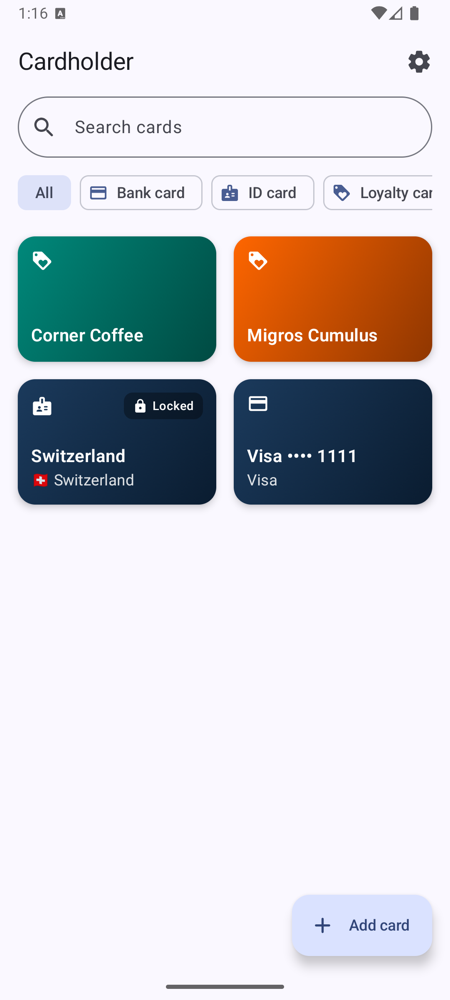
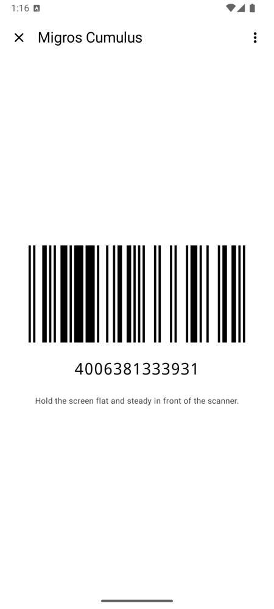
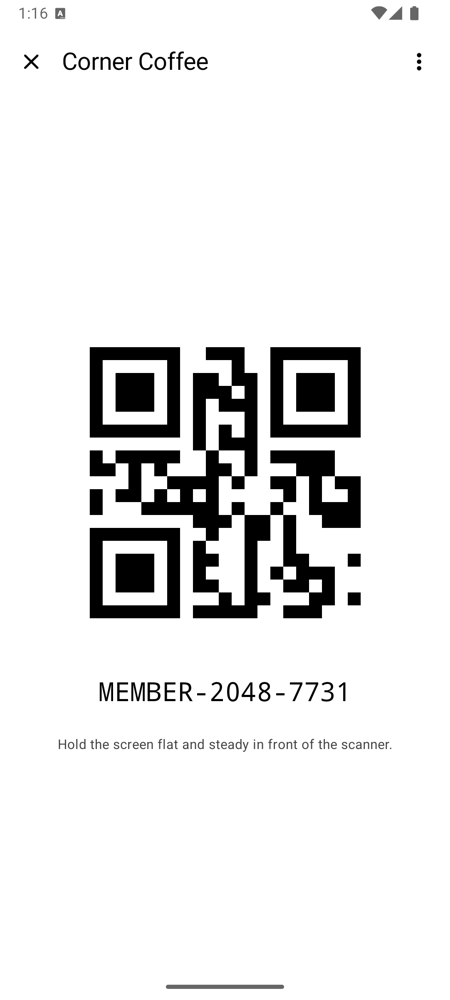
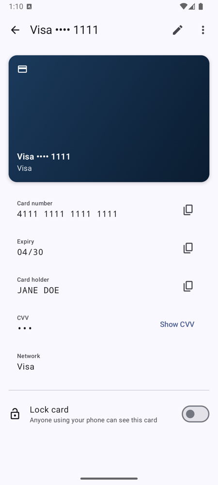

# Cardholder

[](https://github.com/danyk20/cardholder/actions/workflows/ci.yml)
[](LICENSE)


An offline, privacy-first Android wallet for your **bank cards**, **ID cards** and **loyalty cards**.

<p>
  
  
  
  
</p>

## Features
- **Three card types**
  - **Bank card**: issuing bank (catalogue of 145 banks in Europe, Switzerland and the US, or any name), number (network detection, Luhn check), expiry, card holder and CVV. **Tap the card on the phone (NFC)** to fill in number, expiry and, if the card provides it, the holder. The CVV is **always hidden** and only shown after fingerprint, face or device PIN.
  - **ID card**: issuing country (searchable, with flags), optional document number and expiry.
  - **Loyalty card**: shop from a catalogue of 55 shops or a custom name, plus its barcode/QR code, which is shown **right on the card in the list**. Tapping the card shows the code **full-screen at maximum brightness** for the till scanner. 13 symbologies are supported, including EAN, UPC, Code 128/39/93, ITF, Codabar, QR, Aztec, Data Matrix and PDF417.
  - **Shop and bank logos**: pick the official logo (freely licensed, downloaded on request), upload your own, or keep the card plain. Bank cards also show the card network logo (Visa, Mastercard, Amex, Maestro, Discover, JCB, UnionPay, Diners) automatically.
- **Optional photos of both sides**: scan with automatic edge detection (ML Kit document scanner) or pick from the gallery.
- **Scan loyalty codes** with the camera, or let the app find the barcode in a card photo.
- **Per-card lock**: any card can require authentication for *all* its data.
- **Password-encrypted backup** export/import.
- Material 3 with dynamic colour, dark theme, adaptive layout.

## Privacy & security
- **Offline by design.** No analytics, no cloud, no accounts. The only network request the app can make is downloading an official shop logo from Wikimedia Commons when you ask for it (HTTPS only).
- Encrypted database (SQLCipher) **plus** per-value envelope encryption with Android Keystore keys.
- CVVs and locked cards are encrypted with a key the Keystore only releases after **strong biometric or device-credential authentication**. This is real cryptographic protection, not just a UI gate.
- Screenshots and recents thumbnails are blocked on sensitive screens (screenshots can be allowed temporarily in Settings, until you leave the app). Copied values are marked sensitive and cleared after a minute. Decrypted data is dropped when the app goes to the background.

Details: [SECURITY.md](SECURITY.md) and the [architecture decision records](docs/adr).

## Tech stack
Kotlin 2.4 · Jetpack Compose · Material 3 · Hilt · Room + SQLCipher · Android Keystore · CameraX · ML Kit · ZXing · Coil · Coroutines/Flow · kotlinx.serialization · Gradle convention plugins · Spotless/ktlint · detekt · Kover · GitHub Actions

## Building
Requirements: JDK 17+, Android SDK with platform 37.
```bash
./gradlew assembleDebug                      # build the debug app
./gradlew testDebugUnitTest                  # unit & Robolectric tests
./gradlew spotlessCheck detekt lintDebug     # static analysis
./gradlew connectedDebugAndroidTest          # instrumented tests (device/emulator)
./gradlew koverHtmlReport                    # coverage report
```
Releases are built by GitHub Actions; see [docs/RELEASING.md](docs/RELEASING.md).

## Architecture
Multi-module clean architecture with unidirectional data flow. See [docs/ARCHITECTURE.md](docs/ARCHITECTURE.md).
```
app/                 Application, navigation, DI wiring, Coil image loader
build-logic/         Gradle convention plugins
core/model           Pure Kotlin domain models
core/domain          Repository contracts, use cases, validators
core/data            Repository implementations, shop catalogue, backup
core/database        Room + SQLCipher
core/security        Keystore keys, envelope encryption, clipboard, session lock
core/storage         Encrypted card photo storage
core/scanning        Document & barcode scanning (ML Kit, CameraX)
core/barcode         Barcode/QR rendering (ZXing)
core/designsystem    Theme, card surface, icons
core/ui              Shared UI: card face, authenticator, secure screens
core/testing         Test fakes and fixtures
feature/*            Card list, editor, detail, full-screen barcode, settings
```

## Contributing & security
See [CONTRIBUTING.md](CONTRIBUTING.md) and [SECURITY.md](SECURITY.md). Never put real card data in issues.

## License
[Apache License 2.0](LICENSE). Shop names and logos are trademarks of their respective owners and are used only to identify the shop a card belongs to. The repository contains no logo files, only links to freely licensed logos on Wikimedia Commons; see [docs/LOGOS.md](docs/LOGOS.md) for sources and licences.
