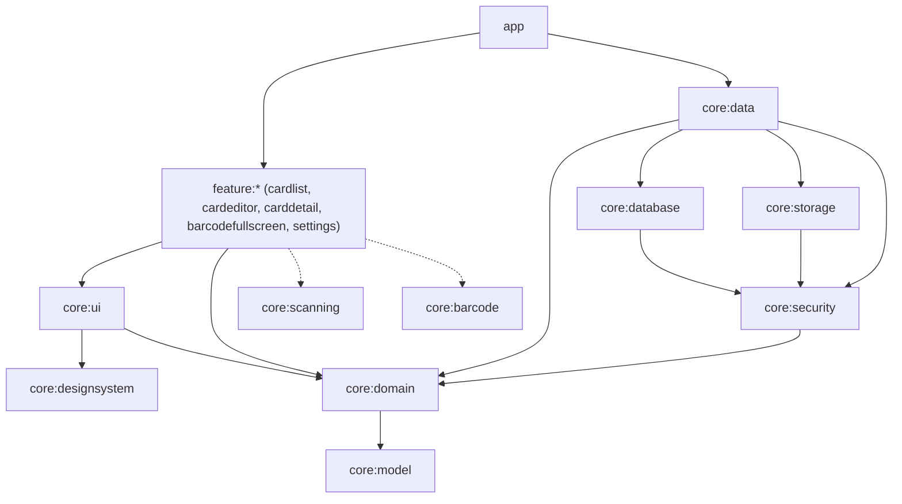

# Architecture

Cardholder follows the [official Android architecture guidance](https://developer.android.com/topic/architecture):
unidirectional data flow, a UI layer of Jetpack Compose screens with `ViewModel`s, a domain layer of
use cases and repository contracts, and a data layer that owns persistence and crypto.

## Modules

Rules:
- `core:model` and `core:domain` are pure Kotlin/JVM: no Android types.
- Features depend on `core:*` only, never on other features; navigation between them is wired in `app`.
- Implementations are bound to `core:domain` interfaces with Hilt modules inside the implementing module.
- Build configuration is shared through convention plugins in `build-logic`.

## Data model
- `Card`: non-sensitive information that can always be shown (title, colour, type, network/country/shop,
  lock state, photo references).
- `CardDetails`: sensitive, type-specific values (number, expiry, holder / document number / loyalty code),
  read separately through `CardRepository.readDetails`, which returns a `SecureResult`
  (`Success`, `AuthenticationRequired`, `KeyInvalidated`).
- CVVs are read through `CardRepository.readCvv` and always require authentication.

## Security
See [SECURITY.md](../SECURITY.md) for the threat model and the ADRs:
1. [Record architecture decisions](adr/0001-record-architecture-decisions.md)
2. [Encryption at rest](adr/0002-encryption-at-rest.md)
3. [Authentication-bound keys](adr/0003-auth-bound-keys.md)
4. [Minimum SDK 30](adr/0004-min-sdk-30.md)
5. [Encrypted backup](adr/0005-encrypted-backup.md)
6. [Scanning with ML Kit](adr/0006-scanning-with-ml-kit.md)
7. [Official shop logos on request](adr/0007-shop-logos.md)
8. [Reading bank cards over NFC](adr/0008-nfc-bank-cards.md)

## Testing
- JVM unit tests for models, validators, use cases, crypto envelope and barcode encoding.
- Robolectric tests for Room DAOs, repositories and ViewModels with fakes from `core:testing`.
- Instrumented tests for real Android Keystore behaviour (`run-instrumented` label / nightly).
